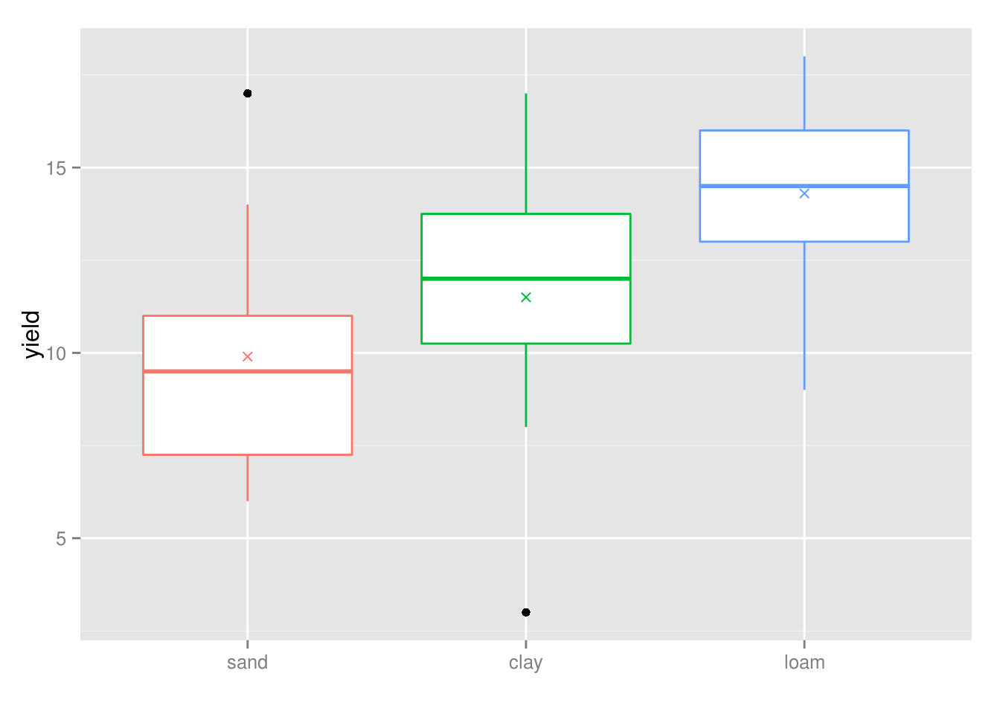
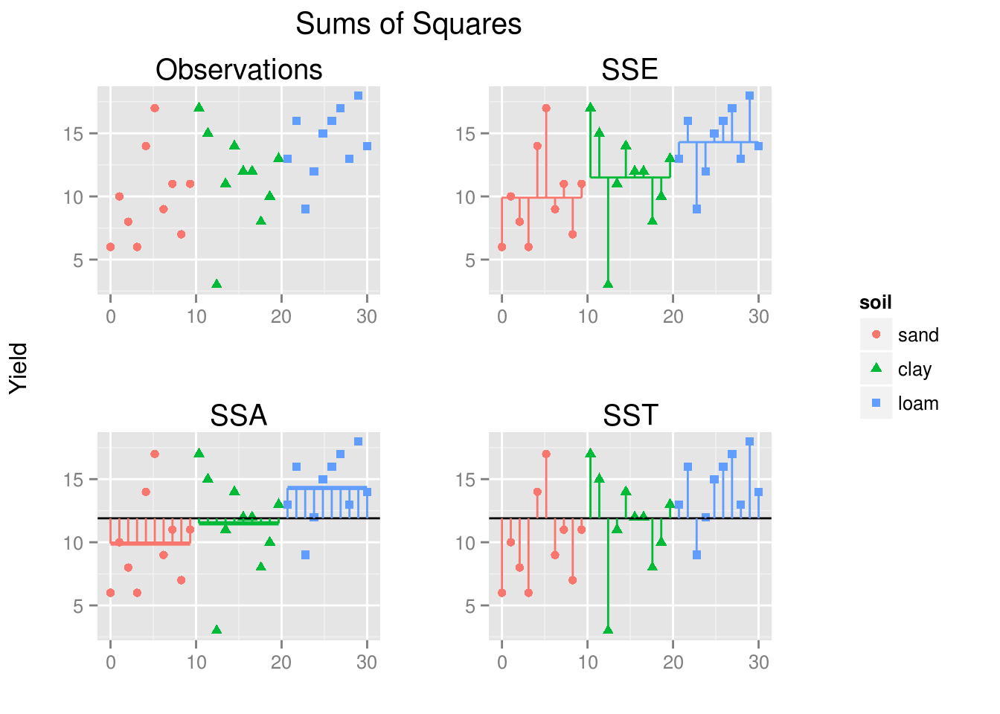

---


ANOVA compares (two or more) means by comparing variances; one-Way ANOVA compares (two or more) means based on one factor by comparing variances.

Data example: crop yields per unit area measured from 10 randomly selected fields on each of 3 soil types (sand, clay, and loam) 


```r
yields<-data.frame(sand=c(6,10,8,6,14,17,9,11,7,11),
                   clay=c(17,15,3,11,14,12,12,8,10,13),
                   loam=c(13,16,9,12,15,16,17,13,18,14))
yields
```

```
##    sand clay loam
## 1     6   17   13
## 2    10   15   16
## 3     8    3    9
## 4     6   11   12
## 5    14   14   15
## 6    17   12   16
## 7     9   12   17
## 8    11    8   13
## 9     7   10   18
## 10   11   13   14
```

We may want to know whether soil types (categorical explanatory variable or factor) significantly affects crop yield (numerical respone variable):

$H_0: \mu_s = \mu_c = \mu_l$

$H_1: \text{at least one mean is different}$

If we take a look at the sample means:


```r
# reshape data to long format
yields_l<-melt(data = yields,
               value.name = "yield",
               measure.vars = c("sand","clay","loam"),
               variable.name = c("soil"))

head(yields_l); tail(yields_l)
```

```
##   soil yield
## 1 sand     6
## 2 sand    10
## 3 sand     8
## 4 sand     6
## 5 sand    14
## 6 sand    17
```

```
##    soil yield
## 25 loam    15
## 26 loam    16
## 27 loam    17
## 28 loam    13
## 29 loam    18
## 30 loam    14
```


```r
# means
means<-summaryBy(formula = yield~soil,data = yields_l,FUN = mean); means
```

```
##   soil yield.mean
## 1 sand        9.9
## 2 clay       11.5
## 3 loam       14.3
```

```r
# or:
aggregate(yield~soil, yields_l, mean)
```

```
##   soil yield
## 1 sand   9.9
## 2 clay  11.5
## 3 loam  14.3
```

and at the distribution of the yield values within the 3 soils:


```r
ggplot(data = yields_l,aes(x = soil,y = yield, color = soil))+
    geom_boxplot()+
    stat_summary(fun.y=mean, geom="point", shape=4)+
    labs(x="")+
    scale_color_discrete(guide=F)
```

 

we can see that yield may turn out to be significantly different between sand and loam soils (their boxes don't overlap), but it is not as clear whether clay yield will be significantly greater/lower than sand/loam yield.

ANOVA allows us to make inferences about differences between means by looking at differences between variances.

### ANOVA assumptions:

---

* Normality of the response varirable (yield)

* Heterocedasticity: homogeneity of variances between groups (soil types)

**Test for normality**

**Test for homocedasticity**

### Deviation (variability) and variance:

---

The distance from any point in a collection of data, to the mean of the data (sample mean), is the deviation. This can be written as:

$y_i-\bar{y}$

where $y_i$ is the *ith* data point, and $\bar{y}$ is the estimate of the mean. If all such deviations are squared (so all differences are positives), and then summed, as in:

$\sum_{i=1}^n\left(y_i-\bar{y}\,\right)^2$

this gives the "sum of squares" for these data.

The deviation is unscaled (the sum of squares will grow with the size of the data collection), so to compare samples of different sizes we need to scale it by dividing it by the degrees of freedom (the number of parameters of the system that may vary independently, or to simplify, the sample size minus 1). In fact, the sample variance of a discrete random variable is defined as:

$S^2=\frac{\sum_{i=1}^{n}(y_i-\bar{y})^2}{n-1}$

So, the deviation is an unscaled measure of dispersion (or variability), that when scaled for the number of degrees of freedom estimates the variance.

### Partition of Sum of Squares:

---

The analysis of variance involves calculating the total variation or variability in the response variable (yield in this case) and partitioning it into two components: the intra-groupal or unexplained variability (variability in each group due to unknown factors) and the inter-groupal or explained variability (variability due to the explanatory variable, soil in this case). This is called the partition of sum of squares, and it allows us to quantify the relative importance of each one of said sources of variability: in our case, if the factor soil has an effect over crop yield, we would expect the total variability to be explained in greater measure by the explained variability than by the unexplained variability:

$\text{TOTAL VARIABILITY = EXPLAINED VARIABILITY + UNEXPLAINED VARIABILITY}$

### Calculating the Sums of Squares

---

#### **SSE**

We can define the variability in the response variable within each group as:

$\text{SSE}=\sum_{i=1}^{k}\sum_{i=j}^{n}(y_{ij}-\bar{y})^2$

that is, the sum of squares of the differences between the observation *j* (*n=10* replicates) within each group and the mean of said group *i* (*k=3* factor levels). This would be the unexplained variation or residual variability (error sum of squares) since it is not explained by the differences between groups.


```r
# data with means
yields_l2<-data.frame(yields_l,mean=rep(means$yield.mean,each = 10))
yields_l2
```

```
##    soil yield mean
## 1  sand     6  9.9
## 2  sand    10  9.9
## 3  sand     8  9.9
## 4  sand     6  9.9
## 5  sand    14  9.9
## 6  sand    17  9.9
## 7  sand     9  9.9
## 8  sand    11  9.9
## 9  sand     7  9.9
## 10 sand    11  9.9
## 11 clay    17 11.5
## 12 clay    15 11.5
## 13 clay     3 11.5
## 14 clay    11 11.5
## 15 clay    14 11.5
## 16 clay    12 11.5
## 17 clay    12 11.5
## 18 clay     8 11.5
## 19 clay    10 11.5
## 20 clay    13 11.5
## 21 loam    13 14.3
## 22 loam    16 14.3
## 23 loam     9 14.3
## 24 loam    12 14.3
## 25 loam    15 14.3
## 26 loam    16 14.3
## 27 loam    17 14.3
## 28 loam    13 14.3
## 29 loam    18 14.3
## 30 loam    14 14.3
```

```r
SSE<-with(data = yields_l2,expr = sum((yield-mean)^2))

SSE
```

```
## [1] 315.5
```

$\\$

#### **SSA**

In a similar way, we can define the variability in the response variable between groups as:

$\text{SSA}=\sum_{i=1}^{k}\sum_{i=j}^{n}(\bar{y_{i}}-\bar{\bar{y}})^2=n*\sum_{i=1}^{k}(\bar{y_{i}}-\bar{\bar{y}})^2$

that is, the sum of squares of the differences between the individual treatment means *n x i* and the overall mean (the mean of all observations


```r
ov.mean<-with(yields_l2, mean(yield)); ov.mean
```

```
## [1] 11.9
```

or the mean of the group means).


```r
ov.mean<-with(means, mean(yield.mean)); ov.mean
```

```
## [1] 11.9
```

This would be the explained variability (the treatment sum of squares).

$\text{SSA}=n*\sum_{i=1}^{k}(\bar{y_{i}}-\bar{\bar{y}})^2$


```r
SSA<-with(means, 10*sum((yield.mean-ov.mean)^2)); SSA
```

```
## [1] 99.2
```

$\text{SSA}=\sum_{i=1}^{k}\sum_{i=j}^{n}(\bar{y_{i}}-\bar{\bar{y}})^2$


```r
with(yields_l2, sum((mean-ov.mean)^2))
```

```
## [1] 99.2
```

$\\$

#### **SST**

The total variability (the total sum of squares) would be then:

$\text{SST}=\sum_{i=1}^{k}\sum_{i=j}^{n}(y_{ij}-\bar{\bar{y}})^2$

that is, the sum of squares of the differences between the observation *ij* and the overall mean.


```r
SST<-with(data = yields_l2,expr = sum((yield-ov.mean)^2))

SST
```

```
## [1] 414.7
```

$\\$

**Plotting the variability**


```r
plotdata<-data.frame(yields_l2,
                     ov.mean, # no need to rep()
                     x=seq(from = 0,to = 30,length.out = nrow(yields_l2)))

p1<-ggplot(data = plotdata,aes(x=x,y=yield,shape=soil,color=soil))+
    geom_point(size=2)+
    labs(x="",y="",title="Observations")
    # if we want to make the legend horizontal:
#     guides(color=guide_legend(direction="horizontal",title.position="top",title.hjust=0.5),
#            shape=guide_legend(direction="horizontal",title.position="top",title.hjust=0.5))

p2<-ggplot(data = plotdata,aes(x=x,y=yield,shape=soil,color=soil))+
    geom_point(size=2)+
    geom_line(aes(y=mean))+
    geom_linerange(aes(ymin=yield,ymax=mean))+
    labs(x="",y="",title="SSE")

p3<-ggplot(data = plotdata,aes(x=x,y=yield,shape=soil,color=soil))+
    geom_point(size=2)+
    geom_line(aes(y=mean),size=1)+
    geom_abline(intercept=11.9,slope=0)+
    geom_linerange(aes(ymin=mean,ymax=ov.mean))+
    labs(x="",y="",title="SSA")

p4<-ggplot(data = plotdata,aes(x=x,y=yield,shape=soil,color=soil))+
    geom_point(size=2)+
    geom_abline(intercept=11.9,slope=0)+
    geom_linerange(aes(ymin=yield,ymax=ov.mean))+
    labs(x="",y="",title="SST")

legend<-gtable_filter(ggplot_gtable(ggplot_build(p1)), "guide-box") # extract legend from p1

grid.arrange(arrangeGrob(p1 + theme(legend.position="none"), 
                         p2 + theme(legend.position="none"),
                         p3 + theme(legend.position="none"),
                         p4 + theme(legend.position="none"), 
                         nrow = 2,
                         main = textGrob("Sums of Squares", vjust = 1, gp = gpar(fontsize=15)),
                         left = textGrob("Yield", rot = 90, vjust = 1)),
             legend,ncol=2,widths=c(4/5,1/5))
```

 

*(extraction of legend and grid.arrange with global Y-axis and common legend as seen [here](http://stackoverflow.com/questions/11076567/plot-a-legend-and-well-spaced-universal-y-axis-and-main-titles-in-grid-arrange))*

$\\$

**In conclusion**

The total sum of squares is the sum of the treatment sum of squares and the error sum of squares:

$SST = SSA + SSE$


```r
all.equal(SST,SSA+SSE)
```

```
## [1] TRUE
```

So the difference between SST and SSE is the treatment sum of squares, SSA:

$SSA = SST - SSE$

This is the amount of the variation in yield that is explained by the differences between the treatment means.

### Drawing the ANOVA table: the F-test

---

**Source of variation**

- Explained variability: type of soil
- Unexplained variability: error
- Total variability


```r
Source<-c("Soil type","Error","Total")
```

$\\$

**Sum of squares**

- SSA
- SSE
- SST


```r
SS<-c(SSA,SSE,SST)
```

$\\$

**Degrees of freedom**

The degrees of freedom are the number of parameters that may vary independently (the number of observations minus 1).

- Treatment degrees of freedom: we are comparing 1 mean per soil type with the overall mean (3 parameters), so we have:   
$3-1=2$ degrees of freedom

- Error degrees of freedom: we are comparing 10 observations per soil type with the soil type mean (10 parameters by soil type), so we have:   
$(10-1)*3=9*3=27$ degrees of freedom

- Total degrees of freedom: we are comparing 30 observations with the overall mean (30 parameters), so we have:   
$30-1=29$ degrees of freedom


```r
df<-c(2,27,29)
```

$\\$

**Mean square**

The mean square is obtained by divinding the sum of squares by the degrees of freedom, and is a measure of the treatment variance and the error variance:


```r
MS<-SS/df
```

The treatment variance is the mean square between groups ($MS_B$):


```r
MS_B<-MS[1]
MS_B
```

```
## [1] 49.6
```

If the group means are equal ($H_0$ is true), $MS_B$ is an estimator of the population variance $\sigma^2$.

The error variance or the mean square error ($MSE$) is the variance within groups (also $MS_W$), and since there is equal replication in each soil type, it is equal to the mean of the variances of the soil types:


```r
MS_W<-MS[2]
MS_W
```

```
## [1] 11.68519
```

```r
vars<-aggregate(yield~soil, yields_l, var); vars
```

```
##   soil     yield
## 1 sand 12.544444
## 2 clay 15.388889
## 3 loam  7.122222
```

```r
mean(vars$yield)
```

```
## [1] 11.68519
```

Since we assume homogeneity of variances, it is also an estimator of the population variance, whether the population means are equal or not. This estimator is also called the *pooled variance* because it is calculated across all the treatments.

The total variance is the total mean square, and it is equal to the variance of all the observations with respect to the overall mean:


```r
MS_T<-MS[3]
MS_T
```

```
## [1] 14.3
```

```r
with(yields_l2,sum((yield-ov.mean)^2)/29)
```

```
## [1] 14.3
```

```r
# or
var(yields_l2$yield)
```

```
## [1] 14.3
```

$\\$

**F ratio**

$F=\frac{MS_B}{MS_W}$

The *F* ratio tests the null hypothesis that the treatment means are all the same:

$H_0: \mu_s = \mu_c = \mu_l$

$H_1: \text{at least one mean is significantly different from the others}$

If the null hypothesis isn't true, we would expect the variability between groups $MS_B$ to be greater than the variability within groups $MS_W$, so we would expect the F-ratio to be > 1. On the contrary, if the null hypothesis is true, we expect the F-ratio to have a value close to 1. 

In terms of variance estimation:

* If the population means are equal, then both $MSE$ and $MS_B$ are estimates of $\sigma^2$ and should therefore be about the same (they will not be exactly the same since they are just estimates and are based on different aspects of the data: the $MS_B$ is computed from the sample means and the $MSE$ is computed from the sample variances). 

* If the population means are not equal, then $MSE$ will still estimate $\sigma^2$ because differences in population means do not affect variances. However, differences in population means affect $MSE$ since differences among population means are associated with differences among sample means. So, $MSE$ estimates $\sigma^2$ whether or not the population means are equal, but $MS_B$ doesn't if they are not.

Therefore, if the $MS_B$ is much larger than the $MSE$, then the population means are unlikely to be equal, but if the $MS_B$ is about the same as $MSE$, then the data are consistent with the null hypothesis that the population means are equal. 


```r
FR<-MS_B/MS_W
FR
```

```
## [1] 4.244691
```

Is this value significant (is $MS_B$ significantly greater than $MS_W$)? To answer this we must compare the test statistic $F=4.24$ with the critical value of $F$, that is, the value in the distribution from which we would be rejecting the null hypothesis. This critical value is the quantile of the probability distribution for a given probability ($0.95$ if $\alpha=0.05$) and degrees of freedom ($df=2$ for the numerator and $df=27$ for the denominator):

$Q(p)\,=\,\inf\left\{ x\in \mathbb{R} : p \le F(x) \right\}$


```r
qf(p = 0.95,df1 = 2,df2 = 27)
```

```
## [1] 3.354131
```

that is, the value $x$ in the $F(x)$ distribution for which the cumulative probability $p = 0.95$ (left tail of the distribution).

As the F-test > critical value, we would reject the null hypothesis. But, in order to be able to work independently from the confidence interval, we use the function for cumulative probabilities of the $F$ distribution instead of using the function for quantiles, so what we are looking for now is the probability of being equal or greater than our quantile (right tail of the distribution); that would be the inverse of the cumulative distribution:

$P(x \geq Ft) = 1 - P(x \leq Ft)$


```r
p_value<-1-pf(q = FR,df1 = 2,df2 = 27)
p_value
```

```
## [1] 0.02495065
```

This is the **p-value**, that is, the probability for a value of being equal or greater than 4.24 when the null hypothesys is true; in this case, the probability of a value being equal or greater than 4.24 by chance would be 0.025 (25 times in 1000). If we are rejecting at a confidence level of 5% ($\alpha=0.05$), we would reject the null hypothesis since $p-value < \alpha$.

$\\$

**The ANOVA table**


```r
AOV.table<-data.frame(Source,SS,df,MS,
                      FR=c(round(FR,3),"",""),
                      p_value=c(round(p_value,3),"",""))
kable(x = AOV.table,digits = 3)
```


|Source    |    SS| df|     MS|FR    |p_value |
|:---------|-----:|--:|------:|:-----|:-------|
|Soil type |  99.2|  2| 49.600|4.245 |0.025   |
|Error     | 315.5| 27| 11.685|      |        |
|Total     | 414.7| 29| 14.300|      |        |

This can be done fitting our analysis-of-variance model with `aov`, and then calling the `summary`:


```r
yields.aov<-with(yields_l,aov(formula = yield~soil))
summary(yields.aov)
```

```
##             Df Sum Sq Mean Sq F value Pr(>F)  
## soil         2   99.2   49.60   4.245  0.025 *
## Residuals   27  315.5   11.69                 
## ---
## Signif. codes:  0 '***' 0.001 '**' 0.01 '*' 0.05 '.' 0.1 ' ' 1
```

$\\$

**In conclusion**

We reject the $H_0: \mu_s = \mu_c = \mu_l \rightarrow$ there are significant differences between soil types (at least one mean is different).

### The T-test

The same ANOVA table can be drawn with the `anova` function after fitting the model with `lm`:


```r
yields.lm<-with(yields_l,lm(formula = yield~soil))
anova(yields.lm)
```

```
## Analysis of Variance Table
## 
## Response: yield
##           Df Sum Sq Mean Sq F value  Pr(>F)  
## soil       2   99.2  49.600  4.2447 0.02495 *
## Residuals 27  315.5  11.685                  
## ---
## Signif. codes:  0 '***' 0.001 '**' 0.01 '*' 0.05 '.' 0.1 ' ' 1
```

If we do the summary of the `lm` fit, we have:


```r
sum.lm<-summary(yields.lm)
sum.lm$coefficients
```

```
##             Estimate Std. Error  t value     Pr(>|t|)
## (Intercept)      9.9   1.080980 9.158353 9.042094e-10
## soilclay         1.6   1.528737 1.046616 3.045565e-01
## soilloam         4.4   1.528737 2.878193 7.728022e-03
```

The main difference between the `aov` and the `lm` approach is the way `summary` handles the fit: 

* `summary(fit.aov)` expresses the fit in terms of analysis of variance
* `summary(fit.lm)` expresses the fit in terms of linear models (the intercept, the slope, and their standard errors)

In the context of aov, the *Intercept* is a mean value; in this case, it corresponds to the mean of the first factor level (*soilsand*). The slopes are differences between means; each one corresponds to the difference between the means of each other factor (*soilclay* and *soilloam*) and the mean of the first one on the Intercept.

$\\$

**Estimate**

The estimate for Intercept is the mean of *soilsand*, the estimate for *soilclay* is the difference between the means of *soilclay* and *soilsand*, and the estimate for *soilloam* is the difference between the means of *soiloam* and *soilsand*:


```r
sum.lm$coefficients[,1]
```

```
## (Intercept)    soilclay    soilloam 
##         9.9         1.6         4.4
```

```r
# means
means
```

```
##   soil yield.mean
## 1 sand        9.9
## 2 clay       11.5
## 3 loam       14.3
```

```r
# sand mean
means$yield.mean[1]
```

```
## [1] 9.9
```

```r
# clay mean - sand mean
means$yield.mean[2]-means$yield.mean[1]
```

```
## [1] 1.6
```

```r
# loam mean - sand mean
means$yield.mean[3]-means$yield.mean[1]
```

```
## [1] 4.4
```

$\\$

**Standard error** (mirar p.418-419 statistics principles and methods)

The standard deviation of a population, $\sigma$ (the square root of the variance population, $\sigma^2$), quantifies the deviation of individuals with respect to the true (the population) mean, $\mu$:

$\sigma = \sqrt{\sigma^2} = \sqrt{\frac{\sum_{i=1}^n (y_i - \mu)^2}{n}}, {\rm \ \ where\ \ } \mu = \frac{\sum_{i=1}^n y_i}{n}$

Its estimate $S$, the standard deviation of a sample, quantifies the deviation of individuals with respect to the sample mean, $\bar{y}$:

$S = \sqrt{S^2} = \sqrt{\frac{\sum_{i=1}^{n}(y_i-\bar{y})^2}{n-1}}$

The standard error of the mean, $SE_\text{mean}$, quantifies the deviation of several sample means (each one with sample size = *n*) with respect to its true mean:

$SE_\text{mean} = \sqrt{\frac{S^2}{n}}$

Since the Intercept is a mean, the standard error associated is the **standard error of the mean**, where the variance $S^2$ is the pooled variance, or error variance $MSE$, or variance within groups $MS_W$ (remember, the mean of the variances of the soil types under the assumption of heterocedasticity), and *n* is the sample size of each group:

$SE_\text{mean} = \sqrt{\frac{MS_W}{n}}$


```r
SE_mean<-sqrt(MS_W/10)
SE_mean
```

```
## [1] 1.08098
```

```r
sum.lm$coefficients[,2]
```

```
## (Intercept)    soilclay    soilloam 
##    1.080980    1.528737    1.528737
```

It is a measure of how accurate our estimate of the mean is likely to be, given the existing variability within groups, and it is equal for each one of the soil type means.

The standard error of the difference between two means, $SE_\text{diff}$, quantifies the existing deviation in several differences between sample means:

$SE_\text{diff}=S_{y_{1}y_{2}} \sqrt{\frac{2}{n}}$

where the combined standard deviation:

$S_{y_{1}y_{2}}=\sqrt{\frac{1}{2}(S_{y_{1}}^2+S_{y_{2}}^2)}$


```r
sum.lm$coefficients
```

```
##             Estimate Std. Error  t value     Pr(>|t|)
## (Intercept)      9.9   1.080980 9.158353 9.042094e-10
## soilclay         1.6   1.528737 1.046616 3.045565e-01
## soilloam         4.4   1.528737 2.878193 7.728022e-03
```

As the second and third row of the `lm.fit` summary are differences between means, the standard error associated is the **standard error of the difference between two means**, where the variance is again the error variance $S_{y_{1}}^2=S_{y_{2}}^2=MS_W$, and *n* is the number of observations in each group:

$S_{y_{1}y_{2}}=\sqrt{\frac{1}{2}(2*MS_W)}$

$SE_\text{diff}=\sqrt{\frac{1}{2}(2*MS_W)} \sqrt{\frac{2}{n}} = \sqrt{2*\frac{MS_W}{n}}$


```r
SE_diff<-sqrt(2*(MS_W/10))
SE_diff
```

```
## [1] 1.528737
```

```r
sum.lm$coefficients[,2]
```

```
## (Intercept)    soilclay    soilloam 
##    1.080980    1.528737    1.528737
```

This is the standard error we need for doing a *t* test to compare any two means:

$t = \frac{\text{a difference}}{\text{standard error of the difference}} \rightarrow t = \frac{\bar{y_{1}}-\bar{y_{2}}}{SE_{diff}}$ $(gl=2*(n-1)=2n-2)$

$\\$

**t-value**

So, the t-value for each pair of soil means would be:

$t_{clay-sand} = \frac{\bar{y}_{clay}-\bar{y}_{sand}}{SE_\text{diff}} = \frac{\text{Estimate}_{c}}{\text{Std. Error}}$


```r
Estimate<-as.numeric(sum.lm$coefficients[,1])
Std.Error<-as.numeric(sum.lm$coefficients[,2])
t_value<-as.numeric(sum.lm$coefficients[,3])

t_cs<-Estimate[2]/Std.Error[2]; t_cs
```

```
## [1] 1.046616
```

```r
# or
with(means,yield.mean[2]-yield.mean[1])/SE_diff
```

```
## [1] 1.046616
```

```r
t_value[2]
```

```
## [1] 1.046616
```

$t_{loam-sand} = \frac{\bar{y}_{loam}-\bar{y}_{sand}}{SE_\text{diff}} = \frac{\text{Estimate}_{l}}{\text{Std. Error}}$


```r
t_ls<-Estimate[3]/Std.Error[3]; t_ls
```

```
## [1] 2.878193
```

```r
# or
with(means,yield.mean[3]-yield.mean[1])/SE_diff
```

```
## [1] 2.878193
```

```r
t_value[3]
```

```
## [1] 2.878193
```

Note that $t_{loam-clay}$ does not appear in the table: 


```r
sum.lm$coefficients
```

```
##             Estimate Std. Error  t value     Pr(>|t|)
## (Intercept)      9.9   1.080980 9.158353 9.042094e-10
## soilclay         1.6   1.528737 1.046616 3.045565e-01
## soilloam         4.4   1.528737 2.878193 7.728022e-03
```

We have to calculate it by substracting their estimates (which equals substracting their means) since the differences on the summary table are all with respect to the Intercept:

$t_{loam-clay} = \frac{\bar{y}_{loam}-\bar{y}_{clay}}{SE_\text{diff}} = \frac{\text{Estimate}_{l}-\text{Estimate}_{c}}{\text{Std. Error}}$


```r
t_lc<-(Estimate[3]-Estimate[2])/SE_diff; t_lc
```

```
## [1] 1.831577
```

```r
# or
with(means,yield.mean[3]-yield.mean[2])/SE_diff
```

```
## [1] 1.831577
```

In order to know if the estimates of the differences between means with their associated standard error are significant, we look for the critical value for the $t$ distribution with $df=18$ and $p=1-\alpha/2=1-0.05/2=0.975$ (it's a two tailed test!):


```r
t_CV<-qt(0.975, 18); t_CV
```

```
## [1] 2.100922
```

and we see if our *t* is greater than the critical value (if we reject the $H_0: \mu_1 = \mu_2$):


```r
t_cs>t_CV
```

```
## [1] FALSE
```

```r
t_ls>t_CV
```

```
## [1] TRUE
```

```r
t_lc>t_CV
```

```
## [1] FALSE
```

$\rightarrow$ we would reject: $H_0: \mu_{\text{sand}} = \mu_{\text{loam}}$

Or better, we look for the **p-value** associated with our *t* in the $t$ distribution (again, it's a two-tailed test so we multiply it by two):


```r
pv_cs<-2*(1-pt(t_cs,18)); pv_cs
```

```
## [1] 0.3091286
```

```r
pv_ls<-2*(1-pt(t_ls,18)); pv_ls
```

```
## [1] 0.01000534
```

```r
pv_lc<-2*(1-pt(t_lc,18)); pv_lc
```

```
## [1] 0.08361664
```

and we see if the p-value is smaller than the confidence level $\alpha$ (if we reject the $H_0$):


```r
pv_cs<0.05 # not exactly equal in the table
```

```
## [1] FALSE
```

```r
pv_ls<0.05 # not exactly equal in the table (pv_ls<0.01)
```

```
## [1] TRUE
```

```r
pv_lc<0.05
```

```
## [1] FALSE
```

$\rightarrow$ again we would reject: $H_0: \mu_{\text{sand}} = \mu_{\text{loam}}$

We can see this graphically with a bar-plot:


So why use ANOVA instead of t-test? $\rightarrow$ ANOVA can test more than one treatment (without taking more risk of making an error type I by doing a t-test for each pair of means), and also allows us to quantify the variability due to them.
